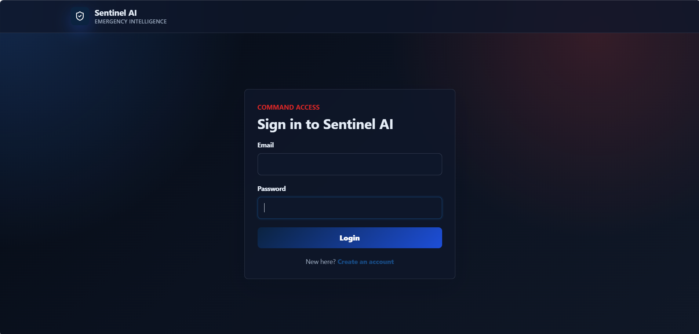
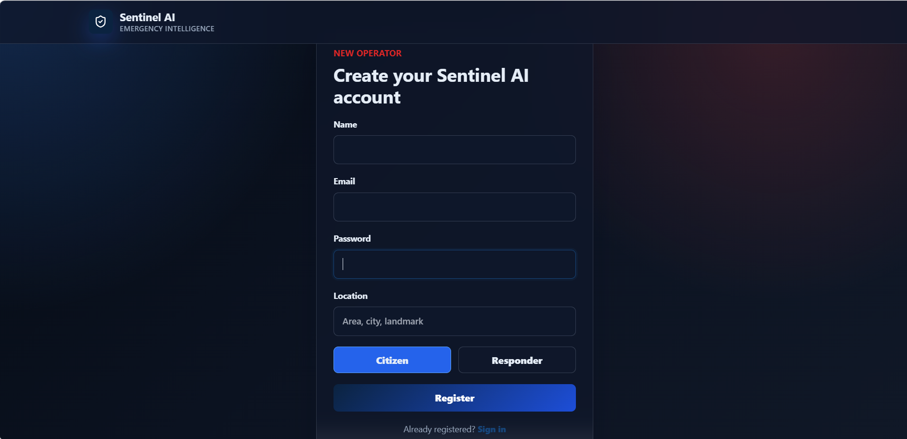
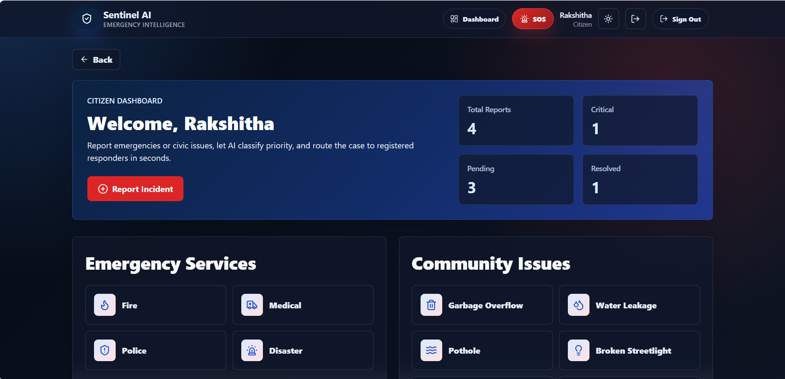
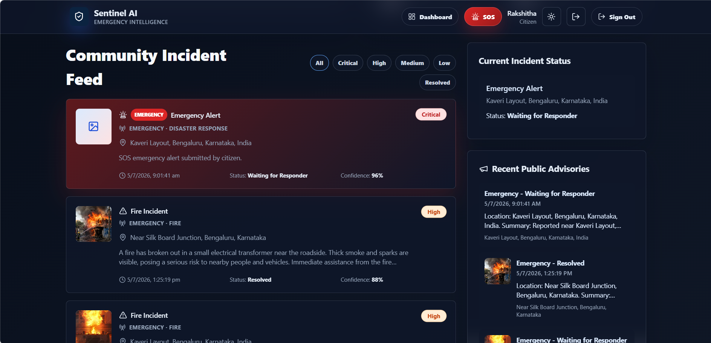
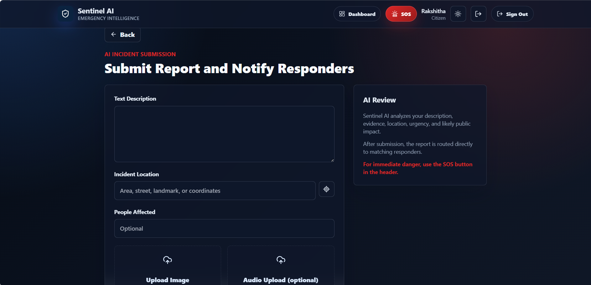
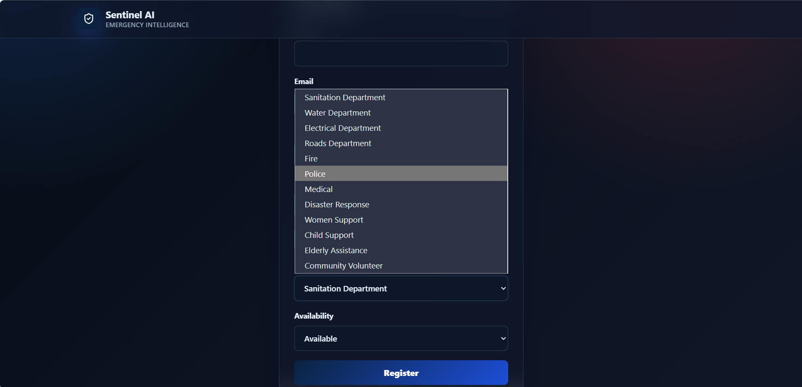
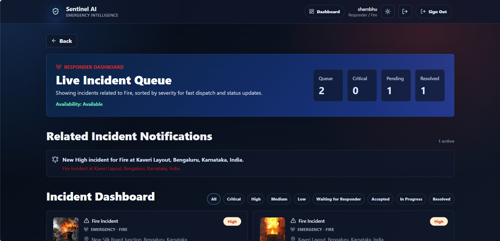
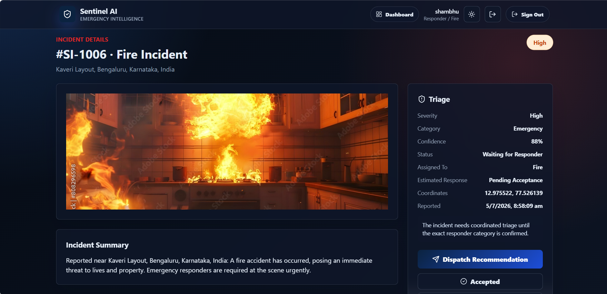
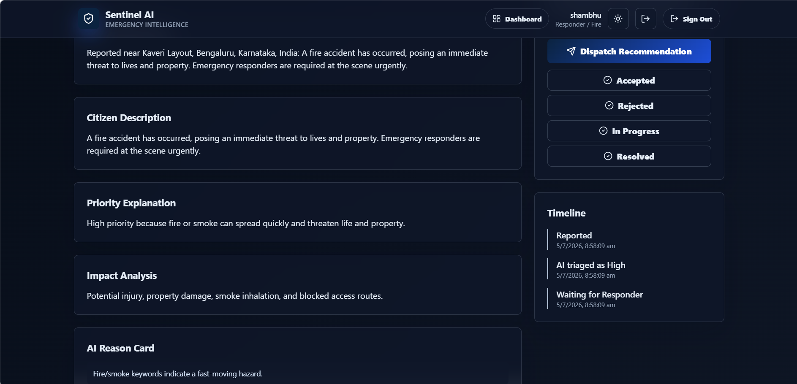
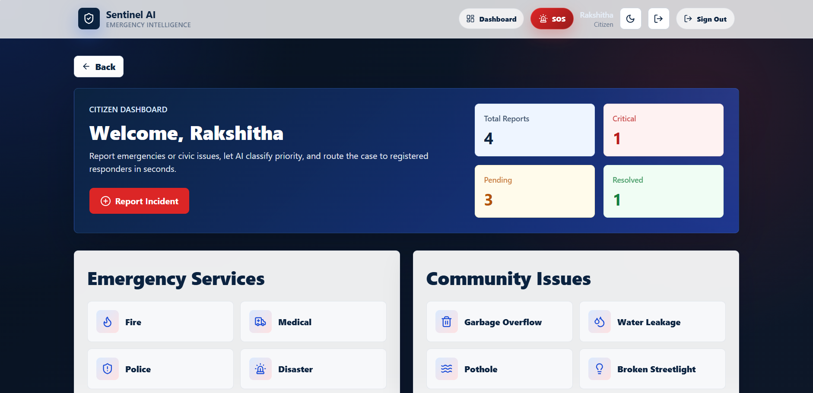

# 🚨 Sentinel AI

### AI-Powered Emergency & Community Intelligence System

Sentinel AI is an AI-powered full-stack platform that connects **citizens** and **emergency responders** through a unified incident reporting and management system. Using **Google Gemini AI**, the platform analyzes reported incidents, determines their severity, recommends the appropriate responder department, and assists authorities in making faster, data-driven decisions.

Beyond emergency response, Sentinel AI enhances **community awareness** by displaying verified incidents on every citizen's dashboard, helping people stay informed about events happening around them.

---

# 🌟 Key Features

## 👤 Citizen Portal

Citizens can:

* Create an account and securely log in.
* Report emergencies and civic issues.
* Upload incident images and optional audio.
* Share incident location and details.
* Receive AI-generated incident analysis.
* View emergency contact recommendations.
* Track the status of submitted reports.
* View incidents reported by other citizens in a shared community dashboard.

---

## 🚒 Responder Portal

Responders can:

* Register under their department.
* Securely log in.
* Set availability status.
* Receive department-specific incident notifications.
* View AI-generated severity and recommendations.
* Accept assigned incidents.
* Update incident status through:

  * Assigned
  * Accepted
  * In Progress
  * Resolved

---

# 🔄 How Sentinel AI Works

### Step 1 — Citizen Reports an Incident

A citizen reports an incident by providing:

* Description
* Location
* Number of people affected
* Image evidence
* Optional audio recording

---

### Step 2 — AI Analysis

Google Gemini AI analyzes the report and generates:

* Incident category
* Severity level
* Confidence score
* Incident summary
* Impact analysis
* Safety recommendations
* Recommended responder department
* Public advisory

---

### Step 3 — Community Awareness

Once submitted:

* The reporting citizen can monitor the incident.
* The incident is displayed on the dashboards of **all citizens**, helping the community stay informed about nearby emergencies and civic issues.

---

### Step 4 — Emergency Response

The incident is routed to the appropriate responder department.

Examples include:

* 🔥 Fire Department
* 🚓 Police
* 🚑 Medical Services
* ⚡ Electricity Board
* ⛽ Gas Services

Responders can review AI insights, accept the incident, and update its progress until resolution.

---

# 🤖 AI Features

Sentinel AI integrates **Google Gemini AI** to provide intelligent decision support by generating:

* Incident classification
* Severity assessment
* Confidence score
* Incident summary
* Impact analysis
* Safety recommendations
* Recommended response department
* Public advisory
* Emergency contact recommendations

Supported emergency contacts include:

* 🚑 Ambulance — 108
* 🔥 Fire — 101
* 🚓 Police — 100
* ⚡ Electricity — 1912
* ⛽ Gas Leakage — 1906
* 🚨 National Emergency — 112

The system also includes a fallback analysis mode, ensuring the application remains functional even when an AI API key is unavailable.

---

# 📸 Application Screenshots

### Citizen Login



### Create Citizen Account



### Citizen Dashboard



### Community Dashboard



### Submit Incident



### Responder Login


### Department Selection



### Responder Dashboard



### Incident Queue



### Incident Management



### Light Theme



---

# 🛠️ Technology Stack

### Frontend

* React
* Vite
* Tailwind CSS
* React Router

### Backend

* FastAPI
* Python

### Database

* SQLite

### Artificial Intelligence

* Google Gemini API

### Deployment

* Vercel (Frontend)
* Render (Backend)

---

# 📁 Project Structure

```text
sentinel-ai/
├── assets/
├── backend/
├── frontend/
├── README.md
└── .gitignore
```

---

# ⚙️ Environment Variables

## Backend

```env
APP_SECRET=change-this-development-secret
DATABASE_PATH=sentinel_ai.db
GEMINI_API_KEY=your_google_ai_studio_key
FRONTEND_ORIGIN=http://localhost:5173
```

## Frontend

```env
VITE_API_URL=http://localhost:8000
```

Production frontend deployments on Vercel must use:

```env
VITE_API_URL=https://sentinel-ai-8j6h.onrender.com
```

---

# 🚀 Running the Project

## Backend

```bash
cd backend
python -m venv .venv
.venv\Scripts\activate
pip install -r requirements.txt
copy .env.example .env
uvicorn app.main:app --reload
```

## Frontend

```bash
cd frontend
npm install
copy .env.example .env
npm run dev
```

## Vercel Frontend Deployment

The repository includes `vercel.json` so Vercel can deploy from the repository root safely:

- Install command: `cd frontend && npm ci`
- Build command: `cd frontend && npm run build`
- Output directory: `frontend/dist`
- SPA rewrites route all frontend paths to `index.html`
- `VITE_API_URL` is set to the Render backend URL

---

# 🌐 API Endpoints

* POST `/auth/register`
* POST `/auth/login`
* GET `/auth/me`
* POST `/ai/analyze`
* POST `/incidents`
* GET `/incidents`
* GET `/incidents/{incident_id}`
* PATCH `/incidents/{incident_id}/status`
* POST `/responders/assign/{incident_id}`
* GET `/responders/assignments`
* GET `/responders/notifications`

---

# 👥 Team

Developed collaboratively by:

Rakshitha R S and
Kruthia C


Version control and collaboration were managed using Git and GitHub.

---

# 🏆 APAC Hackathon 2026

Sentinel AI was developed as a prototype for the **APAC Hackathon 2026** with the vision of building a smarter emergency response and civic intelligence platform. By combining Artificial Intelligence, real-time community reporting, and responder coordination, Sentinel AI aims to improve public safety, increase community awareness, and support faster emergency response.
